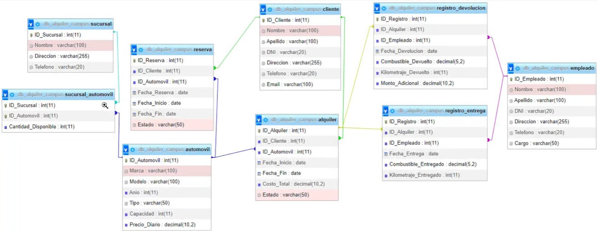

# Clase 1 de mongodb

Se crea una base de datos tomando como referencia la el siguiente diagrama




## Glosario

* use : seleccionar la base de datos a usar
* createCollection : crear nuevas collecciones
* insertMany : insertar multiples documentos en una colleccion
* insertOne : insertar un documento en una colleccion
* findOne : Devuele el documento o vista que satisface la query, si varios documentos satisfacen la query, solo devuelve el primero 

    ejemplos

    de la collecion empleado busca el primero con el nombre Pablo y traeme su id

    ```js

    use("db_alquiler_campus");

    db.empleado.findOne({ nombre: "Pablo" })._id;  
    ```
    
    tambien se puede usar; 1 es para mostar el campo que quiero y 0 para los que no quiero  mostrar, por defecto es 0

    ```js
    
    db.empleado.findOne({ nombre: "Pablo" },{_id:1})

    ```
    resultado

    ```json
    {
        "$oid": "64c98be1448cbd25fbcb3393"
    }
    ```